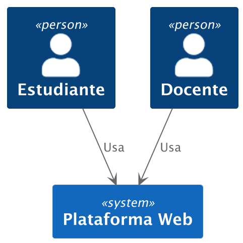
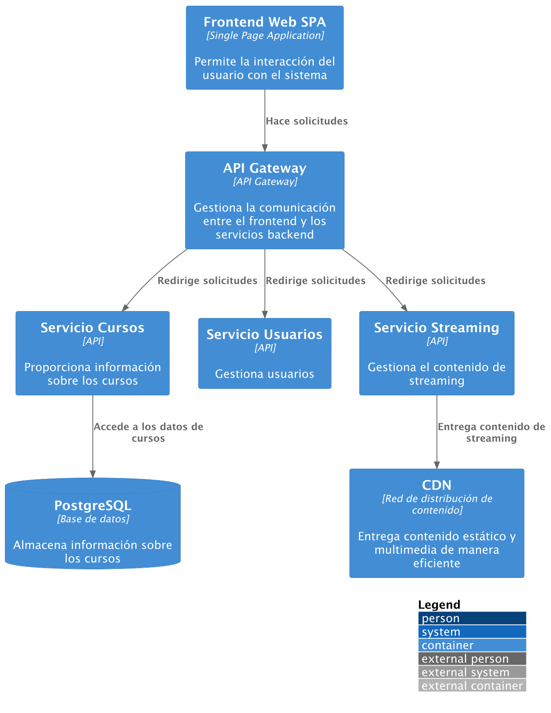
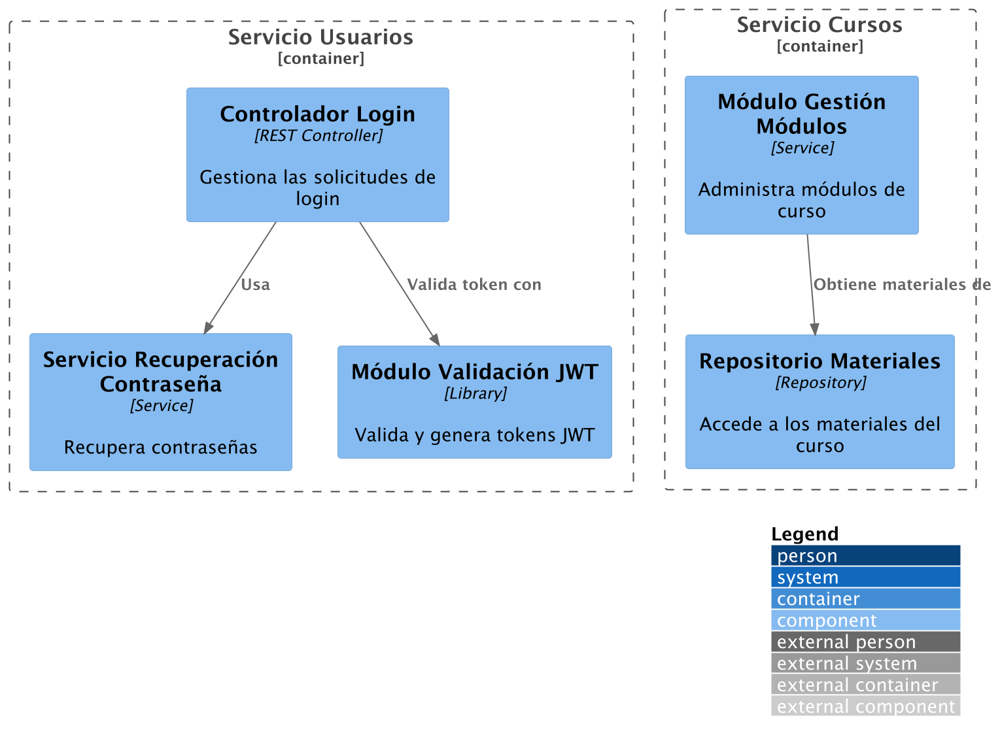
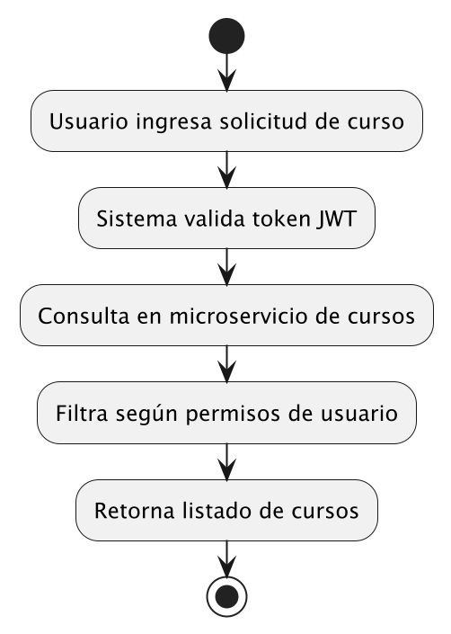

# Arquitectura de Sistemas: TICS317

---

## <center> Guía para el parcial </center>

---
## Caso de estudio: Plataforma Educativa para Cursos en Línea (caso ficticio)

### Contexto:

La startup EduArquitecturaTics317 SpA ha tenido un rápido crecimiento desde el inicio de la pandemia. Su producto estrella es una plataforma que permite a instituciones educativas impartir cursos en línea, ofreciendo contenido asincrónico y sincrónico. Cuenta con más de 200 instituciones afiliadas, 20.000 usuarios activos mensuales y un equipo distribuido entre Santiago, Concepción y Valdivia.

Actualmente, la plataforma enfrenta problemas de escalabilidad durante los eventos en vivo, falta de trazabilidad en los accesos de usuarios, y un sistema de reportes muy limitado. Además, los reclamos por caídas del sistema han aumentado en un 30% en los últimos 6 meses.

El equipo de EduArquitecturaTics317 busca modernizar completamente su infraestructura y arquitectura tecnológica para asegurar la continuidad operativa, ofrecer mejores servicios, y expandirse a otros países de Latinoamérica.

---

## Parte 1. Vista motivacional (Tiempo estimado: 40 minutos)

### a) Cree una tabla con al menos 5 stakeholders y sus elementos motivacionales.
### b) Cree una tabla de requerimientos funcionales
### c) Cree una tabla de requerimientos no funcionales

## Parte 2. Desiciones arquitectonicas
### a) Justifique el patrón arquitectónico elegido y su alineación con los objetivos del negocio.
### b) Describa la infraestructura recomendada.
### c) Proponga un stack tecnológico adecuado.


## Parte 3. Diseño de la Solución (Tiempo estimado: 40 minutos)

### a) Cree diagramas C4 o de la vista 4 + 1 que entreguen una visión general de la arquitectura.
### b) Proponga patrones de diseño (creacionales, estructurales, comportamiento) adecuados para los programadores. Consulte la guía conceptual de patrones.

## Parte 3. Consulta de Inventario de Cursos
### a) Diseñe una consulta de inventario de cursos según el patrón de arquitectura selecionado. Puede presentarla en forma de pseudo código o mediante un diagrama de actividad. 

---

## RESPUESTAS

---

### 1) Vista motivacional


**Respuesta 1_a)**

**Tabla 1:** Vista motivacional

| Stakeholder         | Drivers                           | Metas                                      | Resultados esperados                        | Requerimientos técnicos                  | Restricciones                    |
|---------------------|------------------------------------|--------------------------------------------|---------------------------------------------|------------------------------------------|----------------------------------|
| Director Comercial  | Crecer a nuevos mercados           | Aumentar las ventas en 50% en 1 año        | Plataforma escalable en nuevos países       | Soporte multilenguaje y multi-horario    | Presupuesto limitado             |
| Coordinador Académico | Aumentar satisfacción docente   | Simplificar carga de contenido y seguimiento | Gestión de cursos más fluida              | Interfaces amigables e intuitivas        | Capacitación de docentes limitada |
| Desarrollador Backend | Mejorar rendimiento del sistema | Disminuir carga del servidor en eventos    | Arquitectura desacoplada y escalable       | Microservicios, mensajería               | Tiempo acotado de desarrollo     |
| Alumno               | Experiencia de uso fluida         | Acceder rápido a clases y materiales       | Navegación simple, buen tiempo de carga     | Web responsive, baja latencia            | Conexión inestable en zonas rurales |
| QA Leader            | Asegurar calidad del software     | Reducir errores en producción              | Ciclo de pruebas automatizado               | CI/CD, testeo automatizado               | Herencia técnica del sistema actual |

**Respuesta 1_b)**
Tabla 2: Requerimientos Funcionales

| Requerimiento Funcional | Descripción                                          | Actor principal           |
|--------------------------|------------------------------------------------------|---------------------------|
| RF1                      | Subir y editar contenidos de curso                   | Coordinador Académico     |
| RF2                      | Acceder a clases en vivo y grabadas                  | Alumno                    |
| RF3                      | Generar reportes de avance por estudiante            | Docente                   |
| RF4                      | Autenticación y recuperación de contraseña           | Alumno y Docente          |
| RF5                      | Consultar trazabilidad de accesos                    | QA y Director Técnico     |


**Respuesta 1_c)**
Tabla 3: Requerimientos No Funcionales

| Atributo de calidad | Descripción                                                |
|---------------------|------------------------------------------------------------|
| Escalabilidad        | Capacidad de crecer horizontalmente ante eventos masivos  |
| Disponibilidad       | Mantener 99.9% de uptime en horarios pico                 |
| Seguridad            | Cifrado de datos personales y autenticación fuerte        |
| Usabilidad           | Interfaces intuitivas, compatibles con dispositivos móviles |
| Mantenibilidad       | Arquitectura desacoplada que permita despliegues independientes |

### 2) Decisiones Arquitectónicas  


**Respuesta 2_a)** Patrón arquitectónico propuesto 


**Se propone el uso de una arquitectura de microservicios**, ya que permite escalar los servicios más críticos (como clases en vivo) de forma independiente. Además, habilita despliegues parciales, mejora el mantenimiento y permite dividir tareas entre equipos distribuidos.

**Respuesta 2_b)** Infraestructura recomendada 

-	Nube pública (AWS o Azure) con servicios administrados.
-	Balanceadores de carga entre microservicios.	
-	Bases de datos distribuidas (PostgreSQL y Redis).	
-	VPN privada entre oficinas.	
-	CDN para contenidos multimedia.

**Respuesta 2_c)** Selección de tecnologías 

- Backend (lógica del sistema): Node.js con Express o Python con FastAPI (según el tipo de servicio).
- Frontend (interfaz del usuario): React o Vue.js.
- Base de datos: PostgreSQL (para datos organizados en tablas) y MongoDB (para datos más flexibles).
- Mensajería entre servicios: RabbitMQ.
- Seguridad: OAuth2 y JWT (JSON Web Token) para el inicio de sesión seguro.
- Automatización del desarrollo (CI/CD): GitLab CI con Docker para probar y desplegar código automáticamente.


### 3) Diseño de la Solución (40 minutos)

**Respuesta 3_a)** Diagramas C4 (Vista adaptada en Markdown)

**Nivel de Contexto**
```
[Usuario Estudiante] --> (Plataforma Web)
[Docente] --> (Plataforma Web)
```



Nivel de Contenedores
```
[Frontend Web SPA] --> (API Gateway)
(API Gateway) --> (Servicio Cursos)
(API Gateway) --> (Servicio Usuarios)
(API Gateway) --> (Servicio Streaming)
(Servicio Cursos) --> (PostgreSQL)
(Servicio Streaming) --> (CDN)
```



Nivel de Componentes
```
Servicio Usuarios
  - Controlador Login
  - Servicio Recuperación Contraseña
  - Módulo Validación JWT
Servicio Cursos
  - Módulo Gestión Módulos
  - Repositorio Materiales
```


**Respuesta 3_b)** Patrones de Diseño Propuestos 

Creacionales:
- Factory Method para instanciar servicios de reportes según tipo de usuario.

Estructurales:
- Adapter para integrar sistemas antiguos de autenticación.
- Proxy para streaming de video desde servidores externos.

Comportamiento:
- Observer para notificar usuarios de cambios en su curso.
- Command para ejecutar acciones de administración asincrónicamente.

### 4) Consulta de Inventario de Cursos – Diagrama de Actividad 

## Diagrama de Actividad
```
Inicio
 ↓
Usuario ingresa solicitud de curso
 ↓
Sistema valida token JWT
 ↓
Consulta en microservicio de cursos
 ↓
Filtra según permisos de usuario
 ↓
Retorna listado de cursos
 ↓
Fin
```


## Pseudo código


```python
def consultar_inventario_cursos(request):
    # Paso 1: Extraer token del encabezado
    token = request.headers.get("Authorization")

    # Paso 2: Validar token JWT
    if not validar_jwt(token):
        return respuesta_error("Token inválido o expirado", 401)

    # Paso 3: Obtener información del usuario desde el token
    usuario = decodificar_jwt(token)

    # Paso 4: Consultar el microservicio de cursos
    cursos_disponibles = microservicio_cursos.obtener_cursos()

    # Paso 5: Filtrar cursos según permisos del usuario
    cursos_permitidos = []
    for curso in cursos_disponibles:
        if verificar_permisos(usuario.rol, curso):
            cursos_permitidos.append(curso)

    # Paso 6: Retornar listado de cursos permitidos
    return respuesta_exitosa(cursos_permitidos, 200)
 ```


## Opcion 2 de solución Pseudocódigo (añadido 12 - May)

 ```
PROCEDIMIENTO ConsultarInventarioCursos(solicitud)
    
    // Paso 1: Extraer token del encabezado
    token ← solicitud.encabezados["Authorization"]

    // Paso 2: Validar token JWT
    SI NO ValidarJWT(token) ENTONCES
        RETORNAR Error("Token inválido o expirado", 401)
    FIN SI

    // Paso 3: Obtener información del usuario desde el token
    usuario ← DecodificarJWT(token)

    // Paso 4: Consultar microservicio de cursos
    cursosDisponibles ← ObtenerCursosDesdeMicroservicio()

    // Paso 5: Filtrar cursos según permisos del usuario
    cursosPermitidos ← ListaVacía()
    PARA CADA curso EN cursosDisponibles HACER
        SI VerificarPermisos(usuario.rol, curso) ENTONCES
            AgregarALista(cursosPermitidos, curso)
        FIN SI
    FIN PARA

    // Paso 6: Retornar listado de cursos permitidos
    RETORNAR Exito(cursosPermitidos, 200)

FIN PROCEDIMIENTO
 ```
---

### Términos complementarios

---

Glosario de Términos complementarios
**Arquitectura**
- **API Gateway:** Punto de entrada único para todas las solicitudes externas a una aplicación. Recibe, redirige y gestiona las peticiones hacia los microservicios adecuados. Puede encargarse también de la autenticación, control de acceso y registro de actividad.
- **Microservicios:** Estilo de arquitectura donde una aplicación se divide en pequeños servicios independientes. Cada servicio cumple una función específica y se comunica con los demás, lo que facilita el mantenimiento, escalabilidad y desarrollo por equipos separados.

**Desarrollo y Despliegue**
- **CI/CD (Integración y Despliegue Continuo):** Conjunto de prácticas que automatizan la integración de cambios en el código y su despliegue en producción, permitiendo actualizaciones frecuentes, rápidas y seguras.
- **Docker:** Plataforma que permite empaquetar aplicaciones con todas sus dependencias en contenedores, lo que asegura que funcionen igual en cualquier entorno (desarrollo, pruebas o producción).

**Seguridad**
- **JWT (JSON Web Token):** Formato de token digital utilizado para autenticar usuarios. Contiene información codificada sobre la identidad del usuario y se envía con cada solicitud para verificar que el usuario está autorizado.
- **OAuth2:** Protocolo de autorización que permite a las aplicaciones acceder de manera segura a recursos protegidos en nombre del usuario, sin necesidad de compartir su contraseña (por ejemplo, “iniciar sesión con Google”).

**Comunicación y Rendimiento**
- **RabbitMQ:** Sistema de mensajería que facilita la comunicación entre servicios mediante el envío de mensajes asincrónicos, es decir, sin necesidad de esperar una respuesta inmediata.
- **CDN (Content Delivery Network):** Red de servidores distribuidos geográficamente que entregan contenido estático (como imágenes o videos) desde el servidor más cercano al usuario, mejorando velocidad y rendimiento.

---

<center>TICS 317 - Arquitectura de Sistemas</center>


